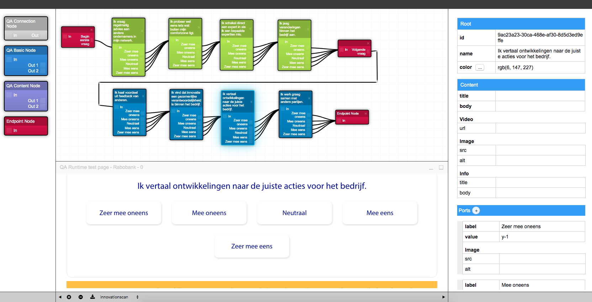

# Diagram editor
A proof of concept for a React based diagram editor. This editor enables a user to visually model a data flow.
This data serves as input for the QA runtime which is also embedded as a preview tool in the editor.
Runtime and data can be deployed to the target website.

## Features

* React 16
* Webpack 4
* Babel 7
* Diagramming editor

## Installation

* `git clone https://github.com/markbleichert/diagram-editor.git`
* cd diagram-editor
* npm install
* npm start
* visit `http://localhost:8080/`
